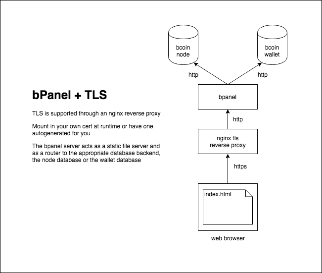

# Architecture

The provided `docker-compose.yml` includes the configuration to set up:

- bPanel routing/static file server
- nginx reverse proxy + tls termination
- bcoin node
- bcoin wallet server
